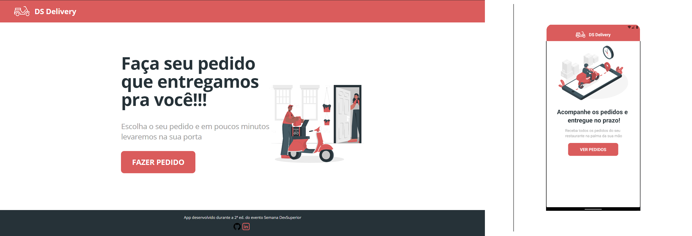

<h1 align="center">
  🍕 DS Delivery
</h1>

  

  
  
  

  

  <a href="#rocket-tecnologias">Tecnologias</a>&nbsp;&nbsp;&nbsp;|&nbsp;&nbsp;&nbsp;
  <a href="#-projeto">Projeto</a>

 

  

## Acesse agora

:star: [DSDelivery](https://cleyxds-dsdelivery.netlify.app/)

## :rocket: Tecnologias

Esse projeto foi desenvolvido com as seguintes tecnologias:

- [Java](https://spring.io/)
- [React](https://reactjs.org)
- [React Native](https://facebook.github.io/react-native/)
- [Expo](https://expo.io/)

## 💻 Projeto

O DSDelivery é um app de delivery de comida, "faça seu pedido pela internet e receba em casa" 😀.

